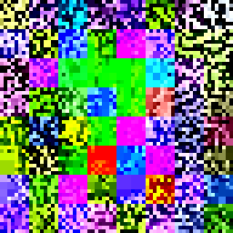
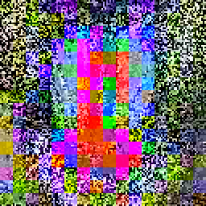
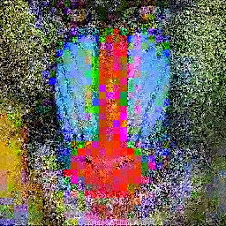

## Fractal compression

Fractal compression is the algorithm of lossy compression that uses properties of contraction mappings and fancy math behind it in order to replace image data (for example, pixel representation of a data) by a huge function, which can generate image on which it was 'learned' from any other image, thanks to math and convergence properties.

See more about Fractal compression [here](https://en.wikipedia.org/wiki/Fractal_compression).

| Image | Iteration |
|:--------------|:----------|
||None (original image) |
| | 1 |
| | 2 |
| | 3 |
| | 4 |
| | 20 |

The function that generated all these images has a size of 16310, which is 44.1 smaller than the original image size.
